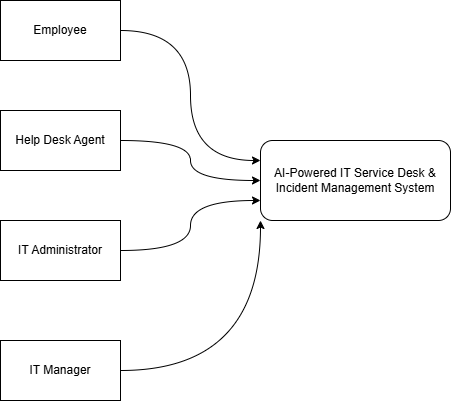

# Step 1 — Confirm Scope

## 1. Purpose
The purpose of this System Design step is to establish and confirm the functional and technical boundary of the AI-Powered IT Service Desk & Incident Management System before architectural and implementation decisions are made.

The scope is derived primarily from the Requirement Analysis, with Database Design v1 used to identify the currently represented and unresolved data areas.

## 2. System Scope
The AI-Powered IT Service Desk & Incident Management System is a centralized platform for reporting, tracking, assigning, communicating about, resolving, and analyzing IT incidents and service requests. The system supports four human actors: Employee, Help Desk Agent, IT Administrator, and IT Manager. AI capabilities assist support personnel with incident analysis and recommendations, while final decisions remain with authorized human users.

## 3. Actors
| Actor | Confirmed Responsibilities |
|---|---|
| Employee | Create incidents/service requests, view submitted incidents, track status, communicate with support, receive notifications, provide feedback |
| Help Desk Agent | View/manage assigned incidents, update status, assign/reassign, modify priority where authorized, communicate, record investigation/resolution details, resolve and close incidents, view history |
| IT Administrator | Create/update/deactivate users, manage roles/permissions, manage categories, configuration and system activity logs |
| IT Manager | View incident statistics, monitor unresolved/escalated incidents, monitor support-team performance, reports and recurring incident patterns |

## 4. Core Functional Scope
### Incident Management

The system must support the requirements around:
    -incident/service-request creation
    -title and description
    -supporting information
    -viewing submitted incidents
    -status tracking
    -assignment/reassignment
    -priority modification
    -investigation
    -resolution
    -closure
    -incident history

### Communication

The system must support communication between employees and support agents.

### User & Administration Management

The system must support:
    -user management
    -account deactivation
    -role/permission management
    -category management
    -system configuration
    -activity logs

### Reporting & Monitoring

The system must support:
    -overall incident statistics
    -unresolved incident monitoring
    -escalated incident monitoring
    -support-team performance
    -incident/support reports
    -recurring incident patterns

## 5. AI Scope
The confirmed AI scope is:

| ID | Capability |
|---|---|
| AI-01 | Analyze newly submitted incident descriptions |
| AI-02 | Suggest category |
| AI-03 | Suggest priority/severity |
| AI-04 | Suggest possible resolutions |
| AI-05 | Identify potentially related/duplicate incidents |
| AI-06 | Generate summaries of lengthy incident conversations |
| AI-07 | AI assistant for common IT support queries |
| AI-08 | Authorized support personnel can accept recommendations |
| AI-09 | Authorized support personnel can override recommendations |
| AI-10 | AI cannot automatically override human decisions |

**Note**:- AI is an assistance capability, not an autonomous decision-maker.

## 6. Automation Scope

| ID | Automation Requirement |
|---|---|
| AR-01 | Notifications for important incident events |
| AR-02 | Notification when incident is assigned |
| AR-03 | Employee notification when status changes |
| AR-04 | Automated escalation when defined conditions are met |
| AR-05 | Notification about critical incidents |
| AR-06 | Record important automated actions |

**Note**: Faculty-provided technology direction: n8n is the designated automation technology for the project.

For Now:
| Item | Status |
|---|---|
| Automation required | **Confirmed — RA** |
| n8n as automation technology | **Faculty-provided direction** |
| Exact n8n workflows | **Not yet designed** |
| ASP.NET Core ↔ n8n interaction | **Design decision pending** |
| Failure handling | **Design decision pending** |

## 7. Management and Administration Scope
Summarize:
    User Management
    Role & Permission Management
    Category Management
    System Configuration
    Activity Logging
    Reporting
    Dashboard/Statistics
    Incident Monitoring
    Support Performance Monitoring

Again, these are requirements, not modules yet.

## 8. Non-Functional Scope
The Requirement Analysis defines six categories of non-functional requirements:

| Category        | Requirements  |
| --------------- | ------------- |
| Performance     | NFR-01–NFR-04 |
| Security        | NFR-05–NFR-09 |
| Availability    | NFR-10–NFR-11 |
| Scalability     | NFR-12–NFR-14 |
| Reliability     | NFR-15–NFR-17 |
| Maintainability | NFR-18–NFR-20 |

**Architecture-Relevant Expectations**:
The following non-functional expectations are particularly relevant to the system design:

- Authenticated access
- Role-based access control
- Protection of administrative functions
- Auditability of important system actions
- Automation failure must not prevent core incident management
- Support for system growth
- Provision for future AI capabilities
- Provision for future automation and integrations
- Maintainable separation of system functions

## 9. Scope Boundaries and Unresolved Decisions

| Area                                  | Current classification         |
| ------------------------------------- | ------------------------------ |
| Incident vs service request handling  | **Unresolved design decision** |
| Exact status lifecycle                | **Unresolved design decision** |
| Exact priority values                 | **Unresolved design decision** |
| Attachment storage approach           | **Unresolved design decision** |
| Incident history representation       | **Unresolved design decision** |
| Feedback structure                    | **Unresolved design decision** |
| Audit-log structure                   | **Unresolved design decision** |
| System configuration storage          | **Unresolved design decision** |
| Investigation/resolution data storage | **Unresolved design decision** |
| AI conversation-summary persistence   | **Unresolved design decision** |
| AI accept/override persistence        | **Unresolved design decision** |
| User deactivation implementation      | **Unresolved design decision** |
| Exact automation workflow design      | **Unresolved design decision** |
| Exact AI assistant architecture       | **Unresolved design decision** |

## 10. Source Traceability

| Scope Area | Requirement Source | Database v1 |
|---|---|---|
| Actors | Actor section | Roles, Users |
| Incident management | FR-01–FR-17 | Incidents, Assignments, Comments |
| Administration | FR-18–FR-22 | Roles, Users, Categories |
| Reporting | FR-23–FR-28 | Partially represented / requires validation |
| AI | AI-01–AI-10 | AIAnalysis |
| Automation | AR-01–AR-06 | Notifications, Escalations; automation logging pending |
| Security/performance/etc. | NFR-01–NFR-20 | Requires System Design validation |

## 11. System Context Diagram

## 12. Step 1 Decision

### Decision: SD-001 — System Scope
Status: **Confirmed**
Basis: **Requirement Analysis Final**

Decision;
    The system scope is confirmed as a centralized IT service desk and incident management platform supporting Employee, Help Desk Agent, IT Administrator and IT Manager roles, with incident management, communication, administration, reporting/monitoring, AI assistance and automated workflows within scope.

Important Qualification:
    Detailed implementation decisions for unresolved areas remain open and will be addressed in later System Design phases and Database v2 validation.

----------------------------------------------------------------------------------